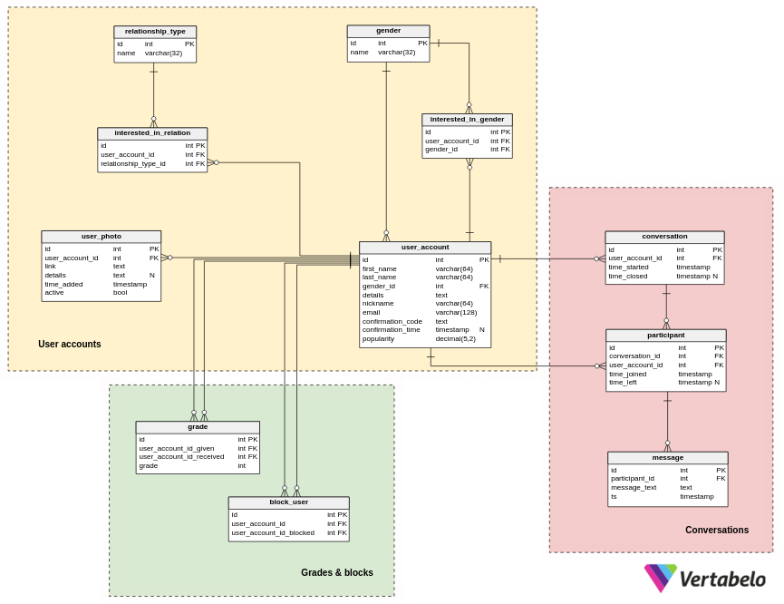

# Dating-App-DataBase
The `MateApp.sql` is the database code for a dating app and is written in SQL for MySQL or MariaDB.

URL of the article where the relationship entity diagram and information is: https://www.vertabelo.com/blog/technical-articles/a-dating-app-data-model

## Entity diagram

